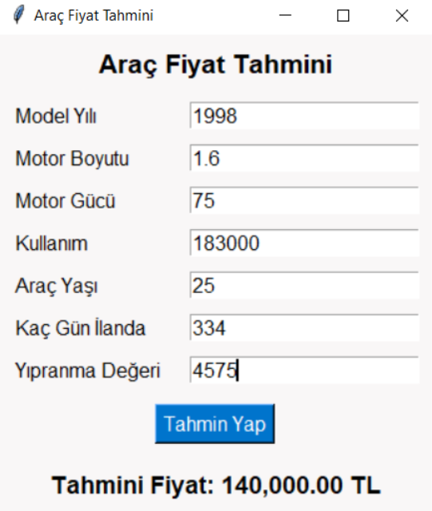

#  Vehicle Price Prediction System

## 📌 Languages / Diller
- [English](#english)
- [Türkçe](#türkçe)


## English

---

# 🚗 Vehicle Price Prediction System

This project was developed to predict vehicle prices based on listing data using machine learning models. It was implemented as part of the **Data Mining** course at Sakarya University of Applied Sciences, Computer Engineering Department.

## 📌 Project Purpose

The goal is to accurately estimate vehicle prices using various features (e.g., model year, engine power, mileage). This can assist users in evaluating vehicle prices or help listing platforms automatically verify price consistency.

---

## 🧪 Technologies Used

- Python (Pandas, NumPy, Scikit-learn, Matplotlib, TensorFlow, Tkinter)
- Machine Learning & Regression Models
- Data Visualization
- GUI with Tkinter

---

## 🧼 Data Processing Steps

- Unnecessary and incomplete rows were removed from the raw dataset (`XXXX` rows were filtered out).
- Outliers in numerical columns were cleaned using the IQR method.
- New features were created through feature engineering (e.g., `vehicle age`, `wear score`, `days listed`).
- Feature selection was performed using correlation analysis.

---

## 🧠 Applied Models & Accuracy Scores

Four different regression models were trained and tested. Based on performance metrics, the following models gave the best results:

| Model                   | Test R² Score | Notes                            |
|------------------------|---------------|----------------------------------|
| ✅ Random Forest        | 0.91          | Best performing model            |
| ✅ Decision Tree        | 0.88          | High accuracy                    |
| ✅ Linear Regression     | 0.84          | Simple and fast                  |
| 🧪 CNN (Neural Network) | 0.78          | Deep learning experiment         |

Sample predictions:

| True Price     | Random Forest | Decision Tree | Linear Regression | CNN       |
|----------------|----------------|----------------|--------------------|-----------|
| 1,075,000 TL   | 1,069,639 TL   | 1,115,000 TL   | 1,070,001 TL       | 1,065,802 TL |
| 425,000 TL     | 451,527 TL     | 455,000 TL     | 455,138 TL         | 420,889 TL   |

---

## 💻 GUI

A desktop interface was developed using `Tkinter`. The user enters vehicle information and the system predicts the price using a pre-trained `Decision Tree Regressor` model.

---

## 📊 Data Visualization

Several analyses were visualized during the project:

- Brand/Model distributions
- Price vs. Model Year
- Vehicle Age vs. Wear Score
- Listing counts by city
- Transmission / Fuel type insights

---

## 📁 Project Structure

```

.
├── data/
│   ├── arac\_ilanlari.csv
│   └── genel\_arac\_verileri\_\*.csv
├── models/
│   ├── cnn\_model.h5
│   ├── random\_forest.pkl
│   └── karar\_agaci\_regresyon.pkl
├── gui/
│   └── tahmin\_arayuz.py
├── visualizations/
│   └── charts/
├── README.md
└── main.ipynb

```

---

## ✨ Conclusion

With comprehensive data cleaning, feature selection, and model comparisons, the project achieved strong results in predicting vehicle prices. The Random Forest model showed the highest accuracy. Outputs of this project can be useful in both academic and real-world automotive applications.



---


## Türkçe

# 🚗 Araç Fiyat Tahmin Sistemi

Bu proje, araçların ilan verileri üzerinden fiyatlarını tahmin etmek amacıyla geliştirilmiş bir makine öğrenmesi projesidir. Sakarya Uygulamalı Bilimler Üniversitesi Bilgisayar Mühendisliği bölümü bünyesinde, Veri Madenciliği dersi kapsamında gerçekleştirilmiştir.

## 📌 Projenin Amacı

Araç ilanlarına ait çeşitli özellikler (model yılı, motor gücü, kullanım durumu vb.) kullanılarak araç fiyatlarının doğru şekilde tahmin edilmesi hedeflenmiştir. Bu sayede hem kullanıcılar için fiyat tahmininde bulunmak hem de ilan sitelerinde otomatik fiyat doğrulaması yapılabilmesi amaçlanmaktadır.

---

## 🧪 Kullanılan Teknolojiler

- Python (Pandas, NumPy, Scikit-learn, Matplotlib, TensorFlow, Tkinter)
- Makine Öğrenmesi ve Regresyon Modelleri
- Veri Görselleştirme
- Tkinter ile Masaüstü Arayüz

---

## 🧼 Veri İşleme Süreci

- Ham veri setinden gereksiz ve eksik satırlar temizlendi (`XXXX` içeren satırlar silindi).
- Sayısal verilerdeki aykırı değerler IQR yöntemiyle temizlendi.
- Öznitelik mühendisliği ile `araç yaşı`, `yıpranma değeri`, `kaç gün ilanda` gibi yeni değişkenler üretildi.
- Korelasyon analizine göre model eğitiminde kullanılacak sütunlar belirlendi.

---

## 🧠 Kullanılan Modeller ve Başarı Oranları

Proje kapsamında 4 farklı regresyon modeli eğitilmiş ve test edilmiştir. Karşılaştırma sonucunda en iyi performans gösteren modeller şunlardır:

| Model                   | Test R² Skoru | Notlar                          |
|------------------------|---------------|---------------------------------|
| ✅ Random Forest        | 0.91          | En başarılı model               |
| ✅ Karar Ağacı          | 0.88          | Tahminler başarılı               |
| ✅ Lineer Regresyon     | 0.84          | Düşük karmaşıklık, hızlı        |
| 🧪 CNN (Yapay Sinir Ağı)| 0.78          | Derin öğrenme ile deneme        |

Model tahmin örnekleri:

| Gerçek Fiyat | Random Forest | Karar Ağacı | Lineer Regresyon | CNN     |
|--------------|----------------|-------------|------------------|---------|
| 1,075,000 TL | 1,069,639 TL   | 1,115,000 TL| 1,070,001 TL     | 1,065,802 TL |
| 425,000 TL   | 451,527 TL     | 455,000 TL  | 455,138 TL       | 420,889 TL   |

---

## 💻 Arayüz

Proje sonunda bir masaüstü arayüz uygulaması (`Tkinter`) geliştirilmiştir. Kullanıcı, araç bilgilerini girerek fiyat tahmini alabilir. Arayüzde kullanılan model: `Karar Ağacı Regresyon`.

---

## 📊 Veri Görselleştirme

Proje sonunda şu analizler görselleştirilmiştir:

- Marka/Model dağılımı
- Fiyat vs. Model Yılı
- Araç Yaşı vs. Yıpranma
- Şehir bazlı ilan dağılımı
- Şanzıman / Yakıt Türü analizleri

---

## 📁 Proje Dosya Yapısı

```

.
├── data/
│   ├── arac\_ilanlari.csv
│   └── genel\_arac\_verileri\_\*.csv
├── models/
│   ├── cnn\_model.h5
│   ├── random\_forest.pkl
│   └── karar\_agaci\_regresyon.pkl
├── gui/
│   └── tahmin\_arayuz.py
├── visualizations/
│   └── grafikler/
├── README.md
└── main.ipynb

```


## ✨ Sonuç

Araç fiyat tahmini konusunda veri temizleme, öznitelik seçimi ve farklı model denemeleriyle anlamlı sonuçlar elde edilmiştir. Random Forest modeli en yüksek doğruluğu vermiştir. Projenin çıktıları, hem akademik hem de sektörel kullanıma uygundur.


---

